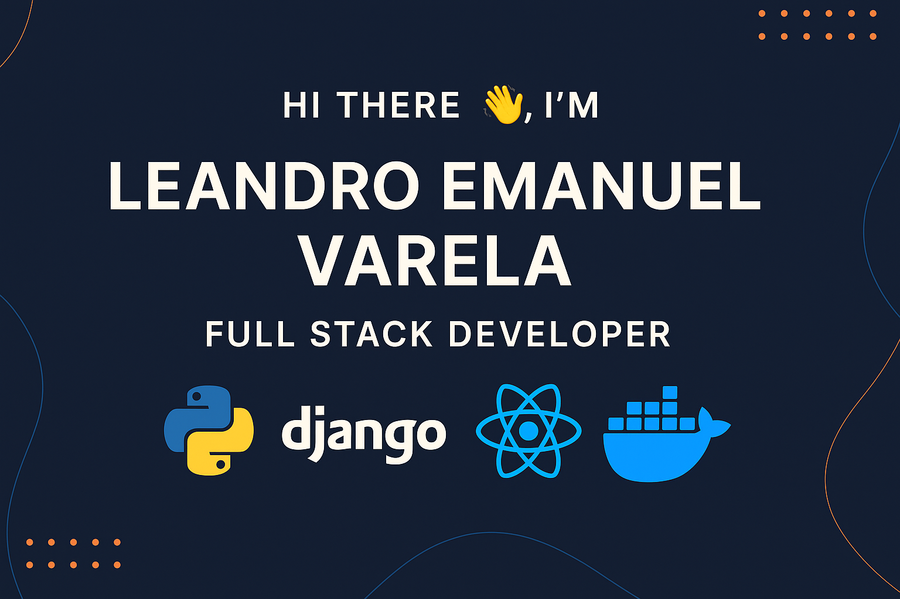

  

  
  
  
  
  

---

## 🧑‍💻 About Me

I'm a Full Stack Developer from Costa Rica with hands-on experience building real-world web applications for logistics, healthcare, and automation. I specialize in robust backend development using **Python**, **Django REST Framework**, and **MySQL**, with deployment managed through **Docker**.

My approach is focused on solving practical challenges — like automating data extraction from public procurement platforms or building complete appointment systems with protected APIs and modular architecture.

I also create **interactive dashboards** with **React** and **Power BI**, allowing teams to visualize and understand their operational data more clearly.

Recently, I've been expanding my skills in **React + Vite**, infrastructure automation, and advanced API design — always aiming to build tools that are clean, secure, and scalable.

## 🔗 Let's Connect

  
  
  

---

## 🚀 Current Projects

-  **ForwardingCR**: Quotation management system (Django + MySQL + Docker)
-  **MyCita**: Healthcare appointment system (React + Django REST)
-  **Public Procurement Scraper**: Python scraping automation + REST API

---

<h2>🚀 Technologies I Have used</h2>

### 💻 Languages & Markup

  
  
  
  
  
  

### 📦 Frameworks & Libraries

  
  
  
  

### 🧪 Testing & Automation

  

### 🗄️ Databases

  
  
  
  

### ☁️ Cloud & DevOps

  
  

### 🔧 Tools & Version Control

  
  
  

## 🏆 GitHub Trophies

  

## 📈 GitHub Stats

  
  

